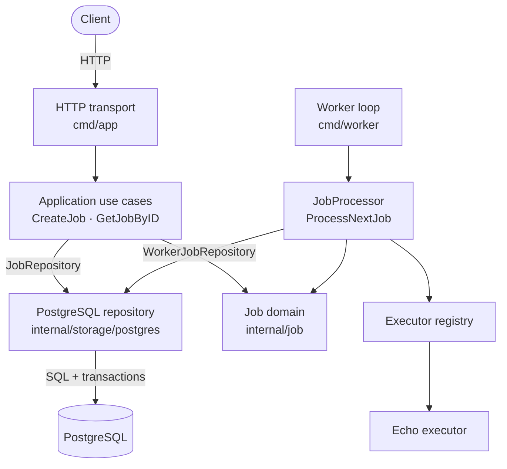
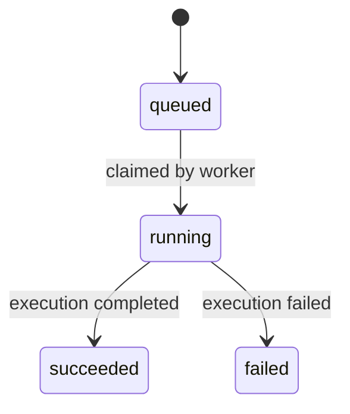

# GoreFlow

English | [Русский](README.ru.md)

GoreFlow is a Go service for durable background job execution. It stores jobs in PostgreSQL, exposes an HTTP API for creating and inspecting them, and is being built around explicit state transitions, concurrent job claiming, leases, and at-least-once execution.

The project is intentionally designed as a modular monolith. PostgreSQL acts as both the durable store and the job queue, so no external message broker is required.

> [!IMPORTANT]
> GoreFlow is currently under active development. The HTTP API and the worker run as separate processes and can execute the first complete `echo` job flow. The complete flow does not yet have an automated integration test.

## Current capabilities

- Durable job storage in PostgreSQL.
- Explicit `queued → running → succeeded/failed` domain transitions.
- `POST /jobs` and `GET /jobs/{id}` HTTP endpoints.
- Transactional job claiming with `FOR UPDATE SKIP LOCKED`.
- Worker ownership metadata through `locked_by` and `lease_until`.
- Generic executor contract and type-based executor registry.
- Idempotent `echo` executor that returns its JSON payload unchanged.
- Application processor that dispatches claimed jobs by type and persists their result or error.
- Polling worker with an idle interval, per-process worker ID, leases, and signal-based graceful shutdown.
- HTTP server timeouts and graceful shutdown on `SIGINT` or `SIGTERM`.
- Docker Compose environment with the API, worker, PostgreSQL, and automatic migrations.
- Table-driven unit tests for the application, HTTP, executor, registry, and worker layers.

## Architecture

GoreFlow keeps business rules independent from HTTP, PostgreSQL, goroutines, and concrete infrastructure libraries.



The repository ports are Go interfaces owned by the application layer. `internal/storage/postgres.Repository` is their PostgreSQL implementation: it translates repository calls into SQL, transactions, and row mapping. It is not a separate service. The API and worker processes each create a repository instance and use the same PostgreSQL database.

Layer responsibilities:

- `internal/job` owns the Job entity and valid lifecycle transitions.
- `internal/application` coordinates use cases and defines repository ports.
- `internal/storage/postgres` contains SQL, transactions, and database mapping.
- `internal/transport/http` validates HTTP input and maps application results to responses.
- `internal/executor` defines the executor contract, registry, and concrete executors.
- `internal/worker` owns polling and graceful worker lifecycle management.
- `cmd` wires concrete implementations together.

More detailed architectural decisions and unresolved questions are tracked in [docs/project-context.md](docs/project-context.md).

## Job lifecycle

The first vertical slice uses a deliberately small state machine:



A newly created job starts with `attempt = 0`, `max_attempts = 1`, and `run_after` set to its creation time. Claiming a job records the worker ID, increments the attempt counter, assigns a lease, and changes its status to `running` in one transaction.

Heartbeat-based lease renewal, crash recovery, retry scheduling, cancellation, and dead-letter behavior are intentionally outside the current MVP slice.

## Tech stack

- Go 1.26.5
- PostgreSQL 15
- `database/sql` with `lib/pq`
- Chi HTTP router
- Docker and Docker Compose

## Getting started

### Prerequisites

- Docker
- Docker Compose

### Run with Docker Compose

Create the local environment file:

```bash
cp .env.example .env
```

Build and start the API, worker, PostgreSQL, and migrations:

```bash
docker compose -f docker-compose.yaml up --build
```

The API will be available at `http://localhost:8080`.

Check its liveness endpoint:

```bash
curl -i http://localhost:8080/health
```

Stop the environment:

```bash
docker compose -f docker-compose.yaml down
```

The current Compose setup does not attach a persistent PostgreSQL volume. The migration container is a temporary runner that executes every `*.up.sql` file without maintaining a migration version table.

## Configuration

| Variable | Used by | Description |
|---|---|---|
| `DATABASE_URL` | API and worker | PostgreSQL connection string used by both Go processes. |
| `DB_USER` | Compose | PostgreSQL user used to initialize the local database. |
| `DB_PASSWORD` | Compose | PostgreSQL password used by PostgreSQL and the migration container. |
| `DB_NAME` | Compose | Name of the local PostgreSQL database. |

The repository contains safe local defaults in `.env.example`. The real `.env` file is ignored by Git.

## HTTP API

### Create a job

```http
POST /jobs
Content-Type: application/json
```

Example request:

```bash
curl -i \
  -X POST http://localhost:8080/jobs \
  -H 'Content-Type: application/json' \
  -d '{"type":"echo","payload":{"message":"hello"}}'
```

Successful response: `201 Created`.

```json
{
  "id": "a61a9ae1-cfe1-4667-886f-4f32b804ef2f",
  "type": "echo",
  "payload": {
    "message": "hello"
  },
  "status": "queued",
  "attempt": 0,
  "max_attempts": 1,
  "run_after": "2026-08-14T10:00:00Z",
  "locked_by": null,
  "lease_until": null,
  "result": null,
  "error": null,
  "created_at": "2026-08-14T10:00:00Z",
  "updated_at": "2026-08-14T10:00:00Z"
}
```

The request body is limited to 1 MiB, must contain exactly one JSON value, and cannot contain unknown top-level fields.

### Get a job

```http
GET /jobs/{id}
```

Example request:

```bash
curl -i http://localhost:8080/jobs/a61a9ae1-cfe1-4667-886f-4f32b804ef2f
```

Successful response: `200 OK` with the current Job representation.

### Error responses

Errors use a consistent JSON shape:

```json
{
  "error": "job not found"
}
```

| Status | Meaning |
|---|---|
| `400 Bad Request` | Invalid JSON body, job data, or UUID. |
| `404 Not Found` | No job exists with the requested ID. |
| `500 Internal Server Error` | An unexpected application or storage error occurred. |

## Concurrent job claiming

PostgreSQL is used as the queue. A worker claims one eligible job inside a transaction using:

```sql
SELECT id, type, payload, status, attempt, max_attempts,
       run_after, locked_by, lease_until, result, error,
       created_at, updated_at
FROM jobs
WHERE status = 'queued'
  AND run_after <= now()
  AND attempt < max_attempts
ORDER BY run_after, created_at
FOR UPDATE SKIP LOCKED
LIMIT 1;
```

The selected row is changed to `running` before the transaction commits. `SKIP LOCKED` allows multiple workers to skip rows already claimed by another transaction instead of waiting for the same job.

The application processor claims one job, resolves its executor from the registry, runs it, and persists either the successful result or the execution error. The worker calls this processor continuously: it immediately asks for another job after completed work and waits for its polling interval only while the queue is empty.

The current `cmd/worker` entry point registers the `echo` executor, creates a unique worker ID, uses a five-second idle polling interval and a 30-second lease, and shuts down on `SIGINT` or `SIGTERM`. These values are initial executable defaults rather than a finalized runtime configuration contract.

## Testing

Run all package tests:

```bash
go test ./...
```

Run unit tests with the race detector:

```bash
go test -race ./...
```

The complete Docker Compose flow has been verified manually: an `echo` job created through `POST /jobs` was claimed by the worker, changed to `succeeded`, and returned the original payload in `result` through `GET /jobs/{id}`. The PostgreSQL repository and this end-to-end flow do not yet have automated integration coverage.

## Project structure

```text
.
├── cmd/app/                    # HTTP API entry point
├── cmd/worker/                 # Worker entry point
├── docs/                       # Architecture and project decisions
├── internal/
│   ├── application/            # Use-case orchestration and ports
│   ├── executor/               # Executor contract, registry, and echo
│   ├── job/                    # Domain model and state transitions
│   ├── storage/postgres/       # PostgreSQL repository
│   ├── transport/http/         # HTTP DTOs and handlers
│   └── worker/                 # Polling loop and worker lifecycle
├── migrations/                 # PostgreSQL up/down migrations
├── Dockerfile
└── docker-compose.yaml
```

## Roadmap to the first MVP

- [x] Job domain model and PostgreSQL migration.
- [x] PostgreSQL repository and transactional claim operation.
- [x] Application use cases for creating and reading jobs.
- [x] HTTP API with graceful shutdown.
- [x] Executor contract, registry, and `echo` executor.
- [x] Worker polling and executor dispatch.
- [x] Persistence of successful results and execution errors.
- [x] Worker graceful shutdown.
- [ ] End-to-end integration test.

After the first vertical slice, the project will move toward heartbeat-based leases, crash recovery, retries with backoff and jitter, cancellation, idempotency, and observability.

## Design principles

- PostgreSQL is both durable storage and the job queue.
- Job state changes are explicit and transactional.
- Domain code remains independent from transport and storage details.
- The system targets at-least-once execution rather than claiming exactly-once semantics.
- Executors must be idempotent because the same job may be executed more than once.
- Reliability features are added incrementally after a working vertical slice.
