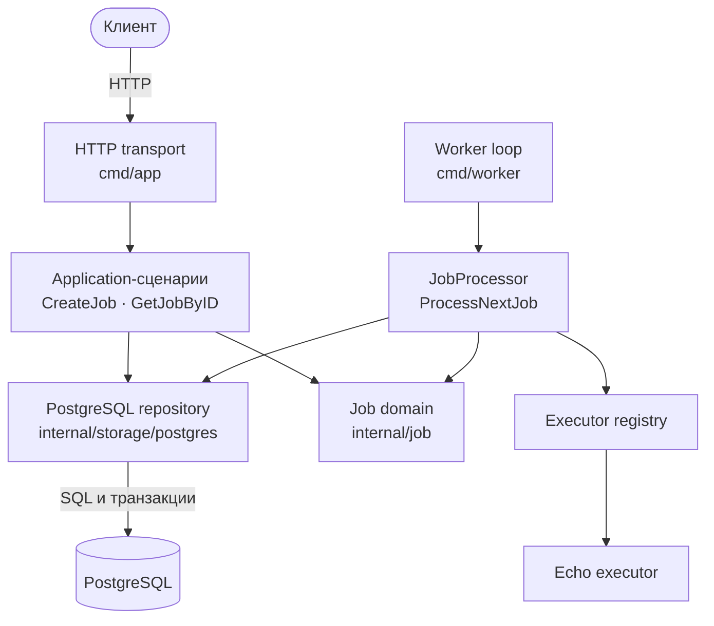
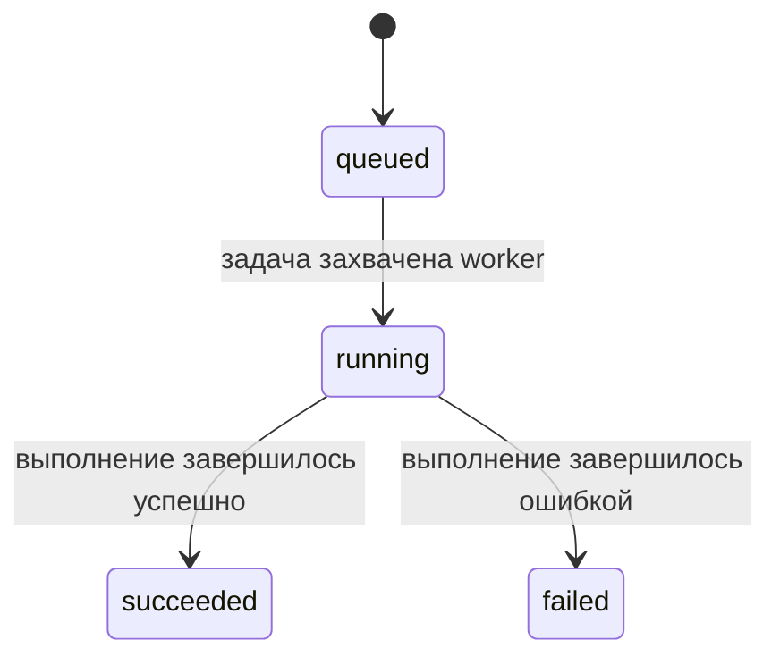

# GoreFlow

[English](README.md) | Русский

GoreFlow — сервис на Go для надёжного выполнения фоновых задач. Он хранит задачи в PostgreSQL, предоставляет HTTP API для их создания и просмотра и строится вокруг явных переходов состояния, конкурентного захвата задач, leases и гарантии выполнения at-least-once.

Проект намеренно разрабатывается как модульный монолит. PostgreSQL одновременно служит постоянным хранилищем и очередью задач, поэтому отдельный брокер сообщений не требуется.

> [!IMPORTANT]
> GoreFlow находится в активной разработке. HTTP API и worker запускаются как отдельные процессы и уже поддерживают первый полный сценарий выполнения `echo`-задачи. Автоматизированного интеграционного теста полного сценария пока нет.

## Текущие возможности

- Надёжное хранение задач в PostgreSQL.
- Явные доменные переходы `queued → running → succeeded/failed`.
- HTTP endpoints `POST /jobs` и `GET /jobs/{id}`.
- Транзакционный захват задач через `FOR UPDATE SKIP LOCKED`.
- Метаданные владения задачей через `locked_by` и `lease_until`.
- Общий контракт executor и registry для выбора executor по типу задачи.
- Идемпотентный `echo` executor, возвращающий входной JSON без изменений.
- Application processor, который выбирает executor и сохраняет результат или ошибку выполнения.
- Polling worker с интервалом ожидания пустой очереди, уникальным ID процесса, lease и graceful shutdown по системному сигналу.
- Таймауты HTTP-сервера и graceful shutdown по `SIGINT` или `SIGTERM`.
- Docker Compose окружение с API, worker, PostgreSQL и автоматическим запуском миграций.
- Table-driven unit-тесты для Job domain, application, HTTP, executor, registry и worker слоёв.

## Архитектура

Бизнес-правила GoreFlow не зависят от HTTP, PostgreSQL, goroutines и конкретных инфраструктурных библиотек.



Repository ports — это Go-интерфейсы, принадлежащие application-слою. `internal/storage/postgres.Repository` является их PostgreSQL-реализацией: преобразует вызовы repository в SQL, транзакции и маппинг строк. Это не отдельный сервис. API и worker создают собственные экземпляры repository и используют одну базу данных PostgreSQL.

Ответственность слоёв:

- `internal/job` содержит сущность Job и допустимые переходы её жизненного цикла.
- `internal/application` координирует сценарии и определяет repository ports.
- `internal/storage/postgres` содержит SQL, транзакции и преобразование данных БД.
- `internal/transport/http` проверяет HTTP-ввод и преобразует результаты application в HTTP-ответы.
- `internal/executor` определяет контракт executor, registry и конкретные executors.
- `internal/worker` отвечает за polling и жизненный цикл worker с graceful shutdown.
- `cmd` связывает конкретные реализации и запускает процессы.

Подробные архитектурные решения и открытые вопросы находятся в [docs/project-context.md](docs/project-context.md).

## Жизненный цикл Job

Первый вертикальный срез использует небольшую машину состояний:



Новая задача создаётся с `attempt = 0`, `max_attempts = 1` и `run_after`, равным времени создания. При захвате задачи записывается ID worker-а, увеличивается счётчик попыток, назначается lease, а статус транзакционно меняется на `running`.

Продление lease через heartbeat, восстановление после падения, retries, cancellation и dead-letter поведение намеренно не входят в текущий MVP-срез.

## Технологии

- Go 1.26.5
- PostgreSQL 15
- `database/sql` с `lib/pq`
- HTTP router Chi
- Docker и Docker Compose

## Запуск проекта

### Требования

- Docker
- Docker Compose

### Запуск через Docker Compose

Создай локальный файл окружения:

```bash
cp .env.example .env
```

Собери и запусти API, worker, PostgreSQL и миграции:

```bash
docker compose up --build
```

API будет доступен по адресу `http://localhost:8080`.

Проверь liveness endpoint:

```bash
curl -i http://localhost:8080/health
```

Для остановки окружения выполни:

```bash
docker compose down
```

Текущая конфигурация Compose не подключает постоянный volume для PostgreSQL. Контейнер миграций также является временным решением: он выполняет каждый файл `*.up.sql`, но не ведёт таблицу версий миграций.

## Конфигурация

| Переменная | Используется | Назначение |
|---|---|---|
| `DATABASE_URL` | API и worker | Строка подключения к PostgreSQL для обоих Go-процессов. |
| `DB_USER` | Compose | Пользователь PostgreSQL для инициализации локальной БД. |
| `DB_PASSWORD` | Compose | Пароль PostgreSQL для БД и контейнера миграций. |
| `DB_NAME` | Compose | Имя локальной базы данных. |

Репозиторий содержит безопасные локальные значения в `.env.example`. Настоящий `.env` игнорируется Git.

## HTTP API

### Создание задачи

```http
POST /jobs
Content-Type: application/json
```

Пример запроса:

```bash
curl -i \
  -X POST http://localhost:8080/jobs \
  -H 'Content-Type: application/json' \
  -d '{"type":"echo","payload":{"message":"hello"}}'
```

Успешный ответ: `201 Created`.

```json
{
  "id": "a61a9ae1-cfe1-4667-886f-4f32b804ef2f",
  "type": "echo",
  "payload": {
    "message": "hello"
  },
  "status": "queued",
  "attempt": 0,
  "max_attempts": 1,
  "run_after": "2026-08-14T10:00:00Z",
  "locked_by": null,
  "lease_until": null,
  "result": null,
  "error": null,
  "created_at": "2026-08-14T10:00:00Z",
  "updated_at": "2026-08-14T10:00:00Z"
}
```

Тело запроса ограничено одним MiB, должно содержать ровно одно JSON-значение и не может содержать неизвестные поля верхнего уровня.

### Получение задачи

```http
GET /jobs/{id}
```

Пример запроса:

```bash
curl -i http://localhost:8080/jobs/a61a9ae1-cfe1-4667-886f-4f32b804ef2f
```

Успешный ответ: `200 OK` с текущим представлением Job.

### Ответы с ошибкой

Ошибки имеют единую JSON-структуру:

```json
{
  "error": "job not found"
}
```

| Статус | Значение |
|---|---|
| `400 Bad Request` | Некорректное JSON-тело, данные Job или UUID. |
| `404 Not Found` | Job с указанным ID не существует. |
| `500 Internal Server Error` | Неожиданная ошибка application или storage. |

## Конкурентный захват задач

PostgreSQL используется как очередь. Worker захватывает одну подходящую задачу внутри транзакции:

```sql
SELECT id, type, payload, status, attempt, max_attempts,
       run_after, locked_by, lease_until, result, error,
       created_at, updated_at
FROM jobs
WHERE status = $1
  AND run_after <= $2
  AND attempt < max_attempts
ORDER BY run_after, created_at
FOR UPDATE SKIP LOCKED
LIMIT 1;
```

Операция claim передаёт статус `queued` как `$1`, а текущее время захвата — как `$2`.

Выбранная строка меняет статус на `running` до commit транзакции. Благодаря `SKIP LOCKED` несколько workers пропускают строки, уже захваченные другой транзакцией, вместо ожидания одной и той же задачи.

Application processor захватывает Job, находит executor по типу, запускает его и сохраняет результат либо ошибку. Worker вызывает processor непрерывно: после обработанной задачи сразу запрашивает следующую, а при пустой очереди ожидает свой polling interval.

Текущий `cmd/worker` регистрирует `echo` executor, создаёт уникальный ID worker-а, использует пятисекундный интервал ожидания пустой очереди и lease длительностью 30 секунд, а также завершает работу по `SIGINT` или `SIGTERM`. Эти значения являются начальными настройками executable, а не окончательным конфигурационным контрактом.

## Тестирование

Запуск всех тестов пакетов:

```bash
go test ./...
```

Запуск unit-тестов с race detector:

```bash
go test -race ./...
```

Domain-тесты Job проверяют создание, успешные переходы жизненного цикла, ошибки валидации, обновление времени и lease, а также инвариант: отклонённый переход не должен частично изменять Job.

Полный Docker Compose-сценарий проверен вручную: `echo`-задача, созданная через `POST /jobs`, была захвачена worker-ом, перешла в `succeeded` и вернула исходный payload в поле `result` через `GET /jobs/{id}`. PostgreSQL repository и этот end-to-end сценарий пока не имеют автоматизированного интеграционного покрытия.

## Структура проекта

```text
.
├── cmd/app/                    # Точка входа HTTP API
├── cmd/worker/                 # Точка входа worker
├── docs/                       # Архитектура и решения проекта
├── internal/
│   ├── application/            # Оркестрация сценариев и ports
│   ├── executor/               # Контракт executor, registry и echo
│   ├── job/                    # Доменная модель и переходы состояния
│   ├── storage/postgres/       # PostgreSQL repository
│   ├── transport/http/         # HTTP DTO и handlers
│   └── worker/                 # Polling loop и жизненный цикл worker
├── migrations/                 # Up/down миграции PostgreSQL
├── Dockerfile
└── docker-compose.yaml
```

## План первого MVP

- [x] Доменная модель Job и миграция PostgreSQL.
- [x] Unit-тесты жизненного цикла Job.
- [x] PostgreSQL repository и транзакционный claim.
- [x] Application-сценарии создания и получения задач.
- [x] HTTP API с graceful shutdown.
- [x] Контракт executor, registry и `echo` executor.
- [x] Polling worker и выбор executor.
- [x] Сохранение успешного результата и ошибки выполнения.
- [x] Graceful shutdown worker-а.
- [ ] End-to-end интеграционный тест.

После первого вертикального среза проект будет развиваться в сторону heartbeat для leases, crash recovery, retries с backoff и jitter, cancellation, idempotency и observability.

## Принципы проектирования

- PostgreSQL одновременно является постоянным хранилищем и очередью.
- Переходы состояния Job явные и сохраняются транзакционно.
- Domain-код не зависит от transport и storage деталей.
- Система ориентируется на at-least-once execution, а не обещает exactly-once.
- Executors должны быть идемпотентными, потому что одна Job может физически выполниться несколько раз.
- Механизмы надёжности добавляются постепенно после работающего вертикального среза.
