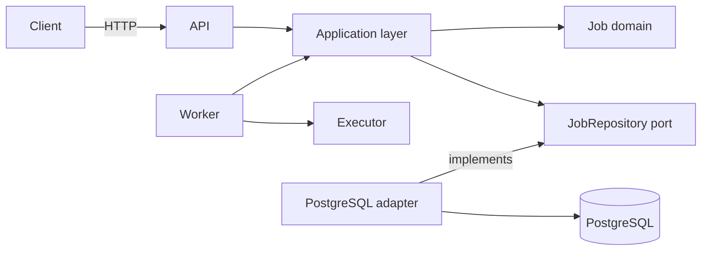
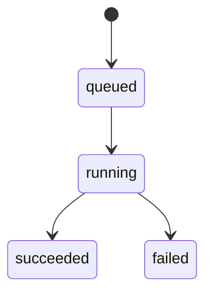
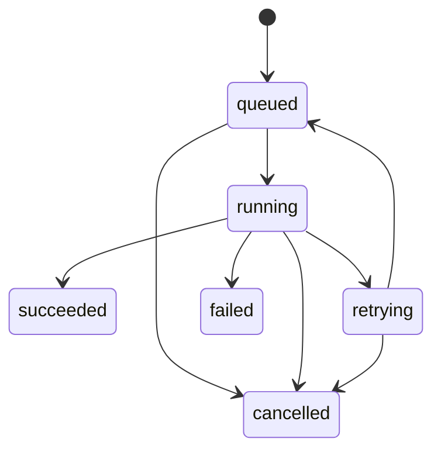

# GoreFlow — контекст проекта

> [!IMPORTANT]
> Этот документ фиксирует только уже согласованный контекст. Конкретные значения, контракты и структуры, которые ещё не выбирались, отмечены как открытые вопросы. Их нельзя считать требованиями только потому, что они упомянуты в roadmap.

## 1. Цель проекта

GoreFlow — учебный backend-сервис на Go для надёжного выполнения фоновых задач и, в дальнейшем, многошаговых workflow.

Система должна позволять поставить работу в очередь, выполнить её одним из workers, сохранить результат и не потерять работу при временной ошибке, падении worker или перезапуске процесса.

Проект выбран как следующий шаг после предыдущих работ с конкурентностью, worker pool, rate limiting, PostgreSQL, Kafka, внешними API, HTTP, миграциями и доменным состоянием. Основная учебная цель — собрать эти навыки в production-подобной системе и изучить:

- долговечное хранение фоновой работы;
- конкурентный захват задач несколькими workers;
- at-least-once execution;
- leases и heartbeats;
- восстановление после падений;
- retry с backoff;
- идемпотентность;
- наблюдаемость и интеграционное тестирование.

Kafka и другие брокеры сообщений намеренно не используются. PostgreSQL служит и постоянным хранилищем, и очередью задач.

## 2. Границы MVP

Первая рабочая версия должна поддерживать один полный вертикальный сценарий:

1. Клиент создаёт задачу через HTTP API.
2. Задача надёжно сохраняется в PostgreSQL.
3. Worker получает задачу и передаёт её подходящему executor.
4. Первый executor имеет тип `echo`.
5. Результат выполнения или ошибка сохраняются.
6. Клиент может получить задачу и её текущее состояние по ID.
7. Полный сценарий покрывается интеграционным тестом.

В MVP входят:

- модель `Job` и первая миграция;
- `POST /jobs`;
- `GET /jobs/{id}`;
- PostgreSQL repository;
- один worker;
- executor `echo`;
- сохранение результата и ошибки.

В MVP не входят:

- Kafka или другой брокер;
- микросервисы;
- DAG и зависимости между шагами;
- визуальный редактор workflow;
- LLM-интеграция;
- сложная авторизация;
- полноценная модель многошагового workflow.

Полноценные leases с heartbeat и crash recovery, retries, cancellation и другие расширенные механизмы жизненного цикла входят в последующие этапы, а не в первый вертикальный срез. Базовые поля lease и их заполнение во время `ClaimJob` уже присутствуют как фундамент будущего механизма восстановления.

## 3. Архитектура

Выбран модульный монолит с двумя исполняемыми процессами: HTTP API и worker. Оба используют общий application/domain-код и PostgreSQL.



Ответственность слоёв:

- **Domain (`job`)** — сущность задачи, состояния и допустимые переходы. Не зависит от HTTP, PostgreSQL, goroutines и конкретных библиотек.
- **Application** — сценарии создания, получения, захвата, завершения, ошибки и отмены задачи. Оркестрирует domain и порты.
- **Storage/PostgreSQL** — SQL, транзакции и преобразование строк БД в доменные сущности.
- **Transport/HTTP** — разбор и проверка HTTP-запроса, вызов application-сценария, формирование ответа. Бизнес-логика в handlers не размещается.
- **Worker** — цикл получения и исполнения задач, graceful shutdown, а позднее heartbeat и восстановление leases.
- **Executor** — обработчик конкретного типа задачи. Для MVP согласован только `echo`.

Предварительно согласованная целевая структура:

```text
cmd/
  api/
  worker/

internal/
  job/
  application/
  storage/postgres/
  executor/
  transport/http/
  worker/

migrations/
tests/
```

Текущая структура репозитория может развиваться к этой схеме постепенно; реорганизация сама по себе не является задачей MVP.

На текущем этапе используется единая точка входа `cmd/app`. Она открывает соединение с PostgreSQL, проверяет его через `Ping`, связывает PostgreSQL repository, application и HTTP transport, после чего запускает HTTP API на порту `8080`. Сервер имеет таймауты чтения и записи и поддерживает graceful shutdown по `SIGINT`/`SIGTERM`: прекращает принимать новые соединения, даёт активным handlers до 10 секунд на завершение и при необходимости принудительно закрывает соединения. Worker в эту точку входа пока не подключён. Разделение на отдельные процессы API и worker произойдёт при реализации worker-сценария.

Отдельный пакет конфигурации пока не используется. Инфраструктурные настройки передаются приложению через переменные окружения.

Текущий application-слой реализует два пользовательских сценария:

- `CreateJob` создаёт доменную сущность через `job.NewJob`, сохраняет её и возвращает созданную задачу;
- `GetJobByID` проверяет идентификатор и получает задачу из repository.

Application владеет узким портом `JobRepository`, в который сейчас входят только необходимые этим сценариям методы `CreateJob` и `GetJobByID`. Методы worker-сценариев не добавляются в порт до их реализации.

Application не импортирует PostgreSQL или `database/sql`. Конкретный PostgreSQL adapter зависит от application-контракта, реализует `JobRepository` и переводит `sql.ErrNoRows` в нейтральную ошибку `application.ErrJobNotFound`. Такое направление зависимости является намеренным: внешний infrastructure adapter зависит от внутреннего порта, а связывание конкретных реализаций должно происходить в `cmd`.

Application-сценарии покрыты table-driven unit-тестами через fake repository. Тесты проверяют успешные операции, доменную валидацию до обращения в storage, передачу аргументов и `context.Context`, а также сохранение цепочки ошибок через `%w` и `errors.Is`.

Текущий executor-слой определяет общий контракт `Executor`:

```go
Execute(ctx context.Context, payload json.RawMessage) (json.RawMessage, error)
```

Первая реализация `EchoExecutor` принимает любой корректный JSON и возвращает его без изменения. `Registry` сопоставляет строковый тип задачи с реализацией `Executor`, отклоняет пустое имя, `nil` executor и повторную регистрацию одного типа. Registry должен заполняться во время сборки приложения до запуска workers, после чего использоваться только для чтения. Executor и registry покрыты unit-тестами, включая проверки с race detector. К worker loop и `cmd/app` они пока не подключены.

## 4. Доменная модель Job

На первом этапе основной доменной сущностью является `Job`.

Согласованный набор данных:

| Поле | Назначение |
|---|---|
| `ID` | идентификатор задачи |
| `Type` | тип executor |
| `Payload` | входные данные задачи |
| `Status` | текущее состояние |
| `Attempt` | количество уже начатых попыток |
| `MaxAttempts` | предельное число попыток |
| `RunAfter` | момент, раньше которого задача не должна запускаться |
| `LockedBy` | worker, владеющий задачей |
| `LeaseUntil` | срок действия владения |
| `Result` | результат выполнения |
| `Error` | информация об ошибке |
| `CreatedAt` | время создания |
| `UpdatedAt` | время последнего изменения |

Для текущего доменного наброска выбраны следующие Go-представления:

- `ID` — `uuid.UUID`;
- `Type`, `LockedBy` и `Error` — `string`;
- `Payload` и `Result` — `json.RawMessage`;
- `Status` — собственный строковый тип `Status`;
- `Attempt` и `MaxAttempts` — `int`;
- временные поля — `time.Time`, значения создаются и обновляются в UTC.

Это рабочие типы первого среза, а не неизменяемый внешний контракт. Текущее HTTP-представление первой версии зафиксировано отдельно в разделе 15 и не должно заставлять domain зависеть от transport DTO.

Доменная `Job` не использует database-specific nullable-типы. PostgreSQL adapter преобразует nullable-значения через `sql.NullString`, `sql.NullTime` и `nil` для отсутствующего результата.

## 5. Workflow, execution и step

Долгосрочная модель проекта предполагает:

- **Workflow** — определение цепочки или графа действий;
- **Execution / Run** — один конкретный запуск workflow;
- **Step** — отдельная единица работы внутри запуска;
- **Job** — работа, которую worker может поставить в очередь, захватить и выполнить через executor.

Пример будущего workflow:

```text
получить данные
      ↓
обработать
      ↓
вызвать внешний API или LLM
      ↓
сохранить результат
      ↓
отправить уведомление
```

> [!NOTE]
> Отношения между Workflow, Execution, Step и Job, правила DAG, формат определения workflow и способ передачи результатов между steps ещё не согласованы. В MVP эти сущности отдельно не реализуются.

## 6. Состояния и переходы

Для первого среза принят и отражён в текущем доменном наброске сокращённый жизненный цикл:



Текущие правила доменной модели:

- новая задача создаётся в `queued`, с `Attempt = 0`, `MaxAttempts = 1` и `RunAfter`, равным времени создания;
- `Start` разрешает только `queued → running`, проверяет `RunAfter` и лимит попыток, увеличивает `Attempt`, записывает владельца и срок lease;
- `Complete` разрешает только `running → succeeded`, сохраняет результат, очищает ошибку и данные владения;
- `Fail` разрешает только `running → failed`, сохраняет ошибку, очищает результат и данные владения;
- успешные переходы обновляют `UpdatedAt`, а недопустимый переход не должен частично изменять задачу;
- `Payload`, `Type`, `Attempt` и `CreatedAt` сохраняются после завершения задачи.

Проверка владельца при завершении, поведение после истечения lease, heartbeat, retries и cancellation этим наброском не определены. Они остаются решениями последующих этапов.

Для задачи/шага согласован следующий целевой жизненный цикл:



Смысл состояний:

- `queued` — задача готова к захвату после наступления `RunAfter`;
- `running` — задача захвачена worker и исполняется;
- `succeeded` — задача успешно завершена;
- `retrying` — попытка завершилась временной ошибкой и ожидается повтор;
- `failed` — дальнейшие попытки не выполняются;
- `cancelled` — выполнение отменено.

Правила переходов должны быть явными и находиться в доменном слое. Изменение сохранённого состояния должно происходить транзакционно.

Отдельный набор состояний для всего workflow execution пока не согласован. До появления модели workflow нельзя автоматически считать состояния Job состояниями Execution.

Также в roadmap упоминалось dead-letter состояние. Его точное имя, семантика и отличие от `failed` пока не определены.

## 7. Получение задач workers

Для конкурентного захвата задач несколькими workers выбран подход на PostgreSQL row locking с `FOR UPDATE SKIP LOCKED`.

Текущая реализация `ClaimJob` внутри транзакции выбирает одну готовую задачу следующим способом:

```sql
SELECT *
FROM jobs
WHERE status = 'queued'
  AND run_after <= now()
  AND attempt < max_attempts
ORDER BY run_after, created_at
FOR UPDATE SKIP LOCKED
LIMIT 1;
```

После блокировки строки repository вызывает доменный переход `Start`, сохраняет состояние `running`, номер попытки, владельца (`LockedBy`), срок lease (`LeaseUntil`) и `UpdatedAt`, а затем фиксирует транзакцию. До commit другие workers не могут получить эту строку через `SKIP LOCKED`.

Размер batch, стратегия polling и необходимые индексы ещё не утверждены.

## 8. Leases и heartbeats

Lease означает временное право конкретного worker выполнять задачу.

Согласованная логика:

1. Worker конкурентно захватывает доступную задачу.
2. Задача получает `LockedBy` и `LeaseUntil` и переходит в `running`.
3. Во время долгого выполнения worker должен продлевать lease через heartbeat.
4. Если worker завершает задачу, он записывает результат или ошибку и выполняет допустимый переход состояния.
5. Если worker погибает и heartbeat прекращается, lease истекает.
6. После истечения lease задача становится доступной для восстановления другим worker.

Не согласованы:

- длительность lease;
- интервал heartbeat;
- механизм fencing/проверки владельца при завершении;
- отдельный recovery loop или восстановление внутри обычного polling;
- точный переход состояния при истёкшем lease.

## 9. Crash recovery

Падение worker не должно приводить к безвозвратной потере задачи. Основой восстановления служит истечение lease: другой worker должен получить возможность подобрать оставшуюся работу.

Целевой демонстрационный сценарий:

1. Запущено несколько workers.
2. Создана работа.
3. Worker завершается принудительно во время исполнения.
4. Его lease истекает.
5. Другой worker подбирает работу.
6. Выполнение завершается без потери задачи.

Эта схема означает возможность физического повторного выполнения. Поэтому система строится вокруг at-least-once semantics, а не обещания exactly-once.

## 10. Retry policy

Повторные попытки предназначены для временных ошибок.

Согласованные составляющие будущей политики:

- счётчик `Attempt`;
- ограничение `MaxAttempts`;
- отложенный запуск через `RunAfter`;
- exponential backoff;
- jitter;
- переход через `retrying` обратно в `queued`;
- окончательное состояние после исчерпания попыток;
- в дальнейшем — dead-letter поведение.

Пока не определены:

- формула backoff;
- минимальная и максимальная задержка;
- источник jitter;
- значения по умолчанию для `MaxAttempts`;
- классификация временных и постоянных ошибок;
- различие между `failed` и будущим dead-letter состоянием.

## 11. Idempotency и гарантии выполнения

Целевая гарантия — **at-least-once execution**. После ошибки сети, истечения lease или падения worker одно и то же действие может начаться больше одного раза.

Следствия:

- executors должны проектироваться идемпотентными;
- повторная обработка не должна создавать повторный логический результат;
- запуск с тем же idempotency key в будущем не должен создавать второй логический execution/job;
- exactly-once не является обещанием системы.

Способ хранения idempotency key, область его уникальности, срок жизни и поведение при конфликте ещё не согласованы. Отдельная таблица idempotency keys также не утверждена.

## 12. Triggers и actions

Для MVP единственный согласованный trigger — HTTP-запрос на создание задачи.

Для MVP единственный action/executor — `echo`, который позволяет проверить полный путь постановки, выполнения и сохранения результата без внешних зависимостей. Его payload может быть любым корректным JSON; результатом является тот же JSON без изменения.

Для выбора executor по `Job.Type` реализован registry с отображением `string → Executor`. При сборке будущего worker тип `echo` должен быть связан с `EchoExecutor`. Если тип отсутствует в registry, worker должен обработать это как ошибку выполнения, а не запускать произвольный executor.

В дальнейших версиях обсуждались возможные actions:

- HTTP request;
- delay;
- LLM request;
- Telegram notification;
- обработка файлов.

Они являются roadmap-идеями, а не утверждённым контрактом. Schema payload, secrets, timeout и rate limits для будущих executors ещё не определены.

Дополнительные triggers, включая расписание, webhook или события, не согласованы. Kafka исключена из выбранной архитектуры.

## 13. Хранение в PostgreSQL

Согласовано:

- PostgreSQL является постоянным хранилищем и очередью;
- первая up-миграция создаёт таблицу `jobs`, down-миграция удаляет её;
- миграции именуются с суффиксами `.up.sql` и `.down.sql`;
- `payload` и `result` хранятся как `JSONB`, ошибка — как `TEXT`;
- конкурентный claim использует транзакцию и `FOR UPDATE SKIP LOCKED`;
- изменение жизненного цикла выполняется транзакционно.

Текущая таблица первой версии:

```text
jobs
  id            UUID PRIMARY KEY
  type          TEXT NOT NULL
  payload       JSONB NOT NULL
  status        TEXT NOT NULL DEFAULT 'queued'
  attempt       INTEGER NOT NULL DEFAULT 0
  max_attempts  INTEGER NOT NULL DEFAULT 1
  run_after     TIMESTAMPTZ NOT NULL DEFAULT now()
  locked_by     TEXT NULL
  lease_until   TIMESTAMPTZ NULL
  result        JSONB NULL
  error         TEXT NULL
  created_at    TIMESTAMPTZ NOT NULL DEFAULT now()
  updated_at    TIMESTAMPTZ NOT NULL DEFAULT now()
```

Миграция также проверяет непустой `type`, допустимый статус, неотрицательный `attempt`, положительный `max_attempts` и условие `attempt <= max_attempts`. Индексы для polling и recovery пока не добавлены.

Текущий PostgreSQL repository реализует:

- `CreateJob` — сохранение новой задачи;
- `GetJobByID` — получение задачи по идентификатору;
- `ClaimJob` — конкурентный транзакционный захват одной готовой задачи;
- `UpdateJob` — сохранение изменяемого состояния задачи;
- общий helper `scanJob` для преобразования строки БД в доменную модель;
- проверку, что update изменил ровно одну строку.

Открытые вопросы структуры БД:

- нужна ли отдельная таблица `job_attempts` для истории;
- какие таблицы понадобятся Workflow, Execution и Step;
- где хранить idempotency keys;
- какие индексы нужны для polling и recovery;
- как очищать или архивировать историю.

## 14. Конфигурация и локальная инфраструктура

На текущем этапе принято простое конфигурирование через переменные окружения:

- приложение читает строку подключения из `DATABASE_URL`;
- `DB_USER`, `DB_PASSWORD` и `DB_NAME` используются Docker Compose для инициализации PostgreSQL и запуска миграций;
- локальный `.env` не добавляется в Git и Docker build context;
- `.env.example` содержит пример локальных значений без реальных секретов.

Для подключения используется стандартный `database/sql` и драйвер `github.com/lib/pq`. `sql.Open` создаёт объект `*sql.DB`, после чего приложение проверяет доступность PostgreSQL через `Ping`.

Локальный Docker Compose содержит три сервиса:

1. `db` — PostgreSQL 15 с healthcheck;
2. `migrations` — одноразовый запуск всех `*.up.sql` через `psql` после готовности БД;
3. `app` — сборка Go-приложения через multi-stage Dockerfile и запуск после успешных миграций.

Внутри Compose строка подключения использует имя сервиса `db`, а не `localhost`.

Текущий запуск миграций через `psql` является временным: он не ведёт таблицу версий и может повторно выполнить уже применённый SQL после пересоздания контейнера. Выбор полноценного migration runner и постоянного Docker volume для PostgreSQL остаётся следующей инфраструктурной задачей.

## 15. HTTP API

В текущем HTTP API реализованы два endpoint для работы с Job и один liveness endpoint:

```text
POST /jobs
GET  /jobs/{id}
GET  /health
```

- `POST /jobs` создаёт и сохраняет задачу.
- `GET /jobs/{id}` возвращает задачу и её текущее состояние.
- `GET /health` возвращает `200 OK` и служит простой liveness-проверкой HTTP-процесса без проверки PostgreSQL.

Все три endpoint реализованы через `chi` и подключены в `cmd/app`. HTTP handlers зависят от узкого интерфейса application-сценариев и не обращаются к PostgreSQL repository напрямую. `ErrJobNotFound` позволяет transport-слою отличить отсутствие задачи от прочих ошибок без зависимости от `database/sql`.

`POST /jobs` принимает объект с полями `type` и `payload` и при успехе отвечает созданной Job со статусом `201 Created`. `GET /jobs/{id}` при успехе отвечает Job со статусом `200 OK`. Внешнее представление Job использует `snake_case`; отсутствующие `locked_by`, `lease_until`, `result` и `error` возвращаются как JSON `null`.

Тело запроса ограничено одним MiB, должно содержать ровно одно JSON-значение и не может содержать неизвестные поля. Ошибочное тело, некорректные данные Job и некорректный UUID получают `400 Bad Request`; отсутствующая Job — `404 Not Found`; неожиданная внутренняя ошибка — `500 Internal Server Error`. Ошибки имеют форму `{"error":"message"}`. Способ передачи будущего idempotency key пока не определён.

HTTP handlers покрыты table-driven unit-тестами через fake application service. Полный интеграционный сценарий с настоящими HTTP-сервером, PostgreSQL и worker ещё не реализован.

В будущем пользователю потребуется возможность:

- создавать определения workflow;
- запускать workflow;
- видеть состояние execution и каждого step;
- отменять выполнение;
- повторять упавшую работу;
- видеть историю попыток и ошибки;
- получать живые обновления через SSE.

Конкретные URL для будущего workflow API не согласованы. WebSocket рассматривался как альтернатива, но выбранным вариантом для будущих живых обновлений был SSE.

## 16. Roadmap

### Этап 1 — модель Job и миграция

- [x] Оформить первоначальный набросок доменной модели.
- [x] Определить допустимые состояния первого среза.
- [x] Создать up/down-миграцию PostgreSQL.
- [ ] Добавить тесты доменных переходов.

Результат: задача может быть корректно представлена в domain и сохранена в БД.

### Этап 2 — создание и получение задач

- [x] Реализовать PostgreSQL repository для создания, получения и обновления Job.
- [x] Определить application port `JobRepository`.
- [x] Реализовать application-сценарии `CreateJob` и `GetJobByID`.
- [x] Покрыть application-сценарии table-driven unit-тестами.
- [x] Реализовать `POST /jobs`.
- [x] Реализовать `GET /jobs/{id}`.
- [x] Реализовать HTTP transport поверх application без прямого доступа к storage.
- [x] Покрыть HTTP handlers table-driven unit-тестами.
- [ ] Покрыть repository и HTTP-сценарии интеграционными тестами.

Результат: клиент может поставить задачу и прочитать её состояние.

### Этап 3 — первый worker и echo executor

- [ ] Реализовать worker loop.
- [x] Определить общий контракт executor и registry типов.
- [x] Реализовать executor `echo`.
- [x] Покрыть executor и registry unit-тестами.
- [ ] Сохранять успешный результат и ошибку.
- [ ] Добавить graceful shutdown worker.
- [ ] Добавить интеграционный тест полного сценария.

Результат: завершён MVP и первый вертикальный срез.

### Этап 4 — конкурентный claim

- [x] Добавить транзакционный claim через PostgreSQL.
- [x] Использовать `FOR UPDATE SKIP LOCKED`.
- [ ] Проверить несколько workers конкурентным интеграционным тестом.

Результат: несколько workers не владеют одной доступной задачей одновременно в рамках операции claim.

### Этап 5 — leases, heartbeat и crash recovery

- [x] Добавить базовое назначение lease при захвате.
- [ ] Добавить heartbeat для продления lease.
- [ ] Восстанавливать работу после истечения lease.
- [ ] Проверить сценарий принудительного завершения worker.

Результат: падение worker не оставляет задачу навсегда в `running`.

### Этап 6 — retries

- [x] Добавить `MaxAttempts` и `RunAfter` в модель, миграцию и условия claim.
- [ ] Разделить временные и окончательные ошибки.
- [ ] Реализовать повторную постановку задачи через `RunAfter`.
- [ ] Добавить exponential backoff и jitter.
- [ ] Проверить retry и исчерпание попыток тестами.

Результат: временная ошибка приводит к управляемому повтору, а не потере или бесконечному выполнению.

### Этап 7 — cancellation и dead-letter поведение

- [ ] Определить семантику отмены queued и running задач.
- [ ] Добавить отмену.
- [ ] Определить и реализовать окончательное dead-letter поведение.
- [ ] Добавить историю попыток, если будет принято соответствующее решение по данным.

Результат: пользователь управляет незавершённой работой и видит окончательно неуспешные задачи.

### Этап 8 — observability и нагрузка

- [x] Добавить Dockerfile и базовый Docker Compose-сценарий локального запуска.
- [ ] Добавить structured logging.
- [ ] Добавить метрики.
- [ ] Добавить OpenTelemetry tracing.
- [ ] Провести нагрузочные и crash-тесты.
- [ ] Подключить версионируемый migration runner и проверить повторный запуск Compose.
- [ ] Настроить CI.

Результат: поведение системы можно наблюдать и проверять под нагрузкой и при сбоях.

### Этап 9 — workflow и зависимости

- [ ] Спроектировать Workflow, Execution и Step.
- [ ] Определить DAG и правила разблокировки зависимых steps.
- [ ] Добавить actions для внешних интеграций.
- [ ] Добавить API и SSE для прогресса execution.
- [ ] Добавить web-интерфейс со списком workflow, runs, steps, logs, retries и cancellation.

Результат: очередь отдельных jobs развивается в систему выполнения многошаговых workflow.

## 17. Архитектурные принципы

- Модульный монолит до появления явной причины для разделения.
- Domain не зависит от HTTP, PostgreSQL, goroutines и инфраструктурных библиотек.
- Application layer оркестрирует сценарии; transport и storage остаются adapters.
- Application владеет портами, а конкретные infrastructure adapters зависят от этих контрактов и связываются в `cmd`.
- PostgreSQL — durable store и очередь; Kafka не используется.
- At-least-once execution плюс идемпотентные executors вместо обещания exactly-once.
- Явная машина состояний и транзакционное изменение состояния.
- Бизнес-логика не размещается в HTTP handlers.
- Workers поддерживают graceful shutdown.
- Сначала маленький проверяемый вертикальный срез, затем механизмы надёжности.

## 18. Открытые вопросы

- Индексы для polling и recovery.
- Выбор migration runner и правила версионирования миграций.
- Настройки пула соединений и timeout проверки PostgreSQL.
- Постоянный Docker volume и политика хранения локальных данных.
- Конкретная retry policy и классификация ошибок.
- Lease duration, heartbeat interval и fencing.
- Семантика восстановления после истечения lease.
- Семантика отмены уже выполняющейся задачи.
- Отличие `failed` от будущего dead-letter состояния.
- Модель хранения попыток.
- Хранение и область уникальности idempotency key.
- Полная модель Workflow, Execution, Step и Job.
- Формат определения DAG и передачи результатов между steps.
- Контракты будущих triggers/actions.

Все эти вопросы требуют отдельного решения. До этого момента агент не должен заполнять их предположениями.
