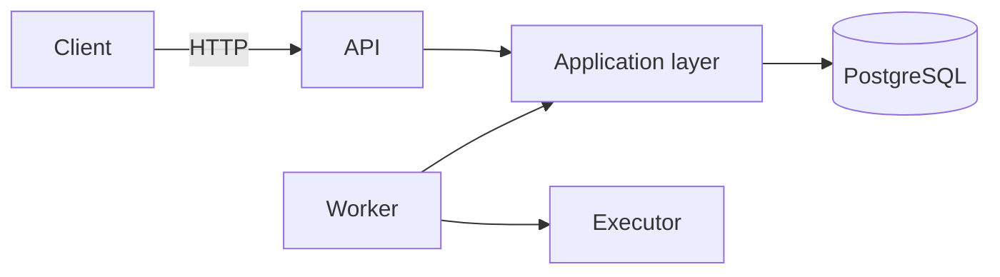
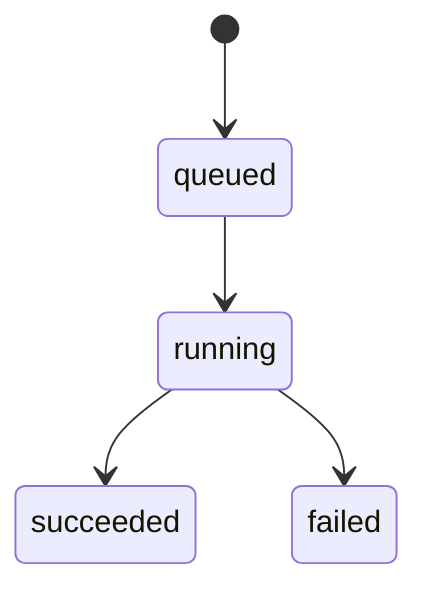
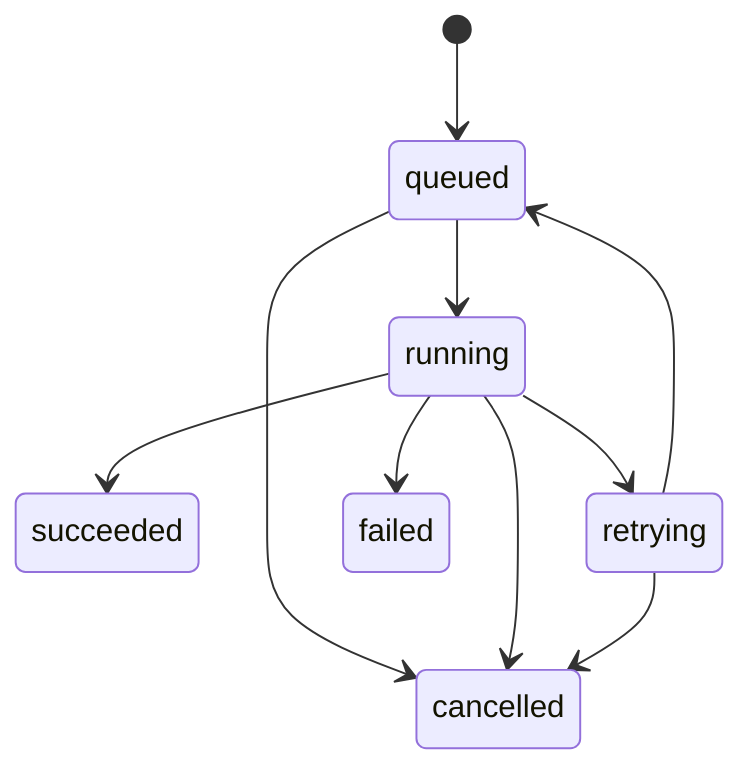

# GoreFlow — контекст проекта

> [!IMPORTANT]
> Этот документ фиксирует только уже согласованный контекст. Конкретные значения, контракты и структуры, которые ещё не выбирались, отмечены как открытые вопросы. Их нельзя считать требованиями только потому, что они упомянуты в roadmap.

## 1. Цель проекта

GoreFlow — учебный backend-сервис на Go для надёжного выполнения фоновых задач и, в дальнейшем, многошаговых workflow.

Система должна позволять поставить работу в очередь, выполнить её одним из workers, сохранить результат и не потерять работу при временной ошибке, падении worker или перезапуске процесса.

Проект выбран как следующий шаг после предыдущих работ с конкурентностью, worker pool, rate limiting, PostgreSQL, Kafka, внешними API, HTTP, миграциями и доменным состоянием. Основная учебная цель — собрать эти навыки в production-подобной системе и изучить:

- долговечное хранение фоновой работы;
- конкурентный захват задач несколькими workers;
- at-least-once execution;
- leases и heartbeats;
- восстановление после падений;
- retry с backoff;
- идемпотентность;
- наблюдаемость и интеграционное тестирование.

Kafka и другие брокеры сообщений намеренно не используются. PostgreSQL служит и постоянным хранилищем, и очередью задач.

## 2. Границы MVP

Первая рабочая версия должна поддерживать один полный вертикальный сценарий:

1. Клиент создаёт задачу через HTTP API.
2. Задача надёжно сохраняется в PostgreSQL.
3. Worker получает задачу и передаёт её подходящему executor.
4. Первый executor имеет тип `echo`.
5. Результат выполнения или ошибка сохраняются.
6. Клиент может получить задачу и её текущее состояние по ID.
7. Полный сценарий покрывается интеграционным тестом.

В MVP входят:

- модель `Job` и первая миграция;
- `POST /jobs`;
- `GET /jobs/{id}`;
- PostgreSQL repository;
- один worker;
- executor `echo`;
- сохранение результата и ошибки.

В MVP не входят:

- Kafka или другой брокер;
- микросервисы;
- DAG и зависимости между шагами;
- визуальный редактор workflow;
- LLM-интеграция;
- сложная авторизация;
- полноценная модель многошагового workflow.

Leases, retries, cancellation и другие механизмы жизненного цикла входят в последующие этапы, а не в первый вертикальный срез.

## 3. Архитектура

Выбран модульный монолит с двумя исполняемыми процессами: HTTP API и worker. Оба используют общий application/domain-код и PostgreSQL.



Ответственность слоёв:

- **Domain (`job`)** — сущность задачи, состояния и допустимые переходы. Не зависит от HTTP, PostgreSQL, goroutines и конкретных библиотек.
- **Application** — сценарии создания, получения, захвата, завершения, ошибки и отмены задачи. Оркестрирует domain и порты.
- **Storage/PostgreSQL** — SQL, транзакции и преобразование строк БД в доменные сущности.
- **Transport/HTTP** — разбор и проверка HTTP-запроса, вызов application-сценария, формирование ответа. Бизнес-логика в handlers не размещается.
- **Worker** — цикл получения и исполнения задач, graceful shutdown, а позднее heartbeat и восстановление leases.
- **Executor** — обработчик конкретного типа задачи. Для MVP согласован только `echo`.

Предварительно согласованная целевая структура:

```text
cmd/
  api/
  worker/

internal/
  job/
  application/
  storage/postgres/
  executor/
  transport/http/
  worker/
  config/

migrations/
tests/
```

Текущая структура репозитория может развиваться к этой схеме постепенно; реорганизация сама по себе не является задачей MVP.

## 4. Доменная модель Job

На первом этапе основной доменной сущностью является `Job`.

Согласованный набор данных:

| Поле | Назначение |
|---|---|
| `ID` | идентификатор задачи |
| `Type` | тип executor |
| `Payload` | входные данные задачи |
| `Status` | текущее состояние |
| `Attempt` | количество уже начатых попыток |
| `MaxAttempts` | предельное число попыток |
| `RunAfter` | момент, раньше которого задача не должна запускаться |
| `LockedBy` | worker, владеющий задачей |
| `LeaseUntil` | срок действия владения |
| `Result` | результат выполнения |
| `Error` | информация об ошибке |
| `CreatedAt` | время создания |
| `UpdatedAt` | время последнего изменения |

Для текущего доменного наброска выбраны следующие Go-представления:

- `ID` — `uuid.UUID`;
- `Type`, `LockedBy` и `Error` — `string`;
- `Payload` и `Result` — `[]byte`;
- `Status` — собственный строковый тип `Status`;
- `Attempt` и `MaxAttempts` — `int`;
- временные поля — `time.Time`, значения создаются и обновляются в UTC.

Это рабочие типы первого среза, а не неизменяемый внешний или storage-контракт. Формат данных в HTTP API, SQL-типы и преобразование отсутствующих значений в `NULL` будут определены при реализации соответствующих adapters.

Доменная `Job` не должна использовать database-specific nullable-типы. При необходимости PostgreSQL adapter может иметь внутреннюю модель строки и преобразовывать её в доменную сущность.

## 5. Workflow, execution и step

Долгосрочная модель проекта предполагает:

- **Workflow** — определение цепочки или графа действий;
- **Execution / Run** — один конкретный запуск workflow;
- **Step** — отдельная единица работы внутри запуска;
- **Job** — работа, которую worker может поставить в очередь, захватить и выполнить через executor.

Пример будущего workflow:

```text
получить данные
      ↓
обработать
      ↓
вызвать внешний API или LLM
      ↓
сохранить результат
      ↓
отправить уведомление
```

> [!NOTE]
> Отношения между Workflow, Execution, Step и Job, правила DAG, формат определения workflow и способ передачи результатов между steps ещё не согласованы. В MVP эти сущности отдельно не реализуются.

## 6. Состояния и переходы

Для первого среза принят и отражён в текущем доменном наброске сокращённый жизненный цикл:



Текущие правила доменной модели:

- новая задача создаётся в `queued`, с `Attempt = 0`, `MaxAttempts = 1` и `RunAfter`, равным времени создания;
- `Start` разрешает только `queued → running`, проверяет `RunAfter` и лимит попыток, увеличивает `Attempt`, записывает владельца и срок lease;
- `Complete` разрешает только `running → succeeded`, сохраняет результат, очищает ошибку и данные владения;
- `Fail` разрешает только `running → failed`, сохраняет ошибку, очищает результат и данные владения;
- успешные переходы обновляют `UpdatedAt`, а недопустимый переход не должен частично изменять задачу;
- `Payload`, `Type`, `Attempt` и `CreatedAt` сохраняются после завершения задачи.

Проверка владельца при завершении, поведение после истечения lease, heartbeat, retries и cancellation этим наброском не определены. Они остаются решениями последующих этапов.

Для задачи/шага согласован следующий целевой жизненный цикл:



Смысл состояний:

- `queued` — задача готова к захвату после наступления `RunAfter`;
- `running` — задача захвачена worker и исполняется;
- `succeeded` — задача успешно завершена;
- `retrying` — попытка завершилась временной ошибкой и ожидается повтор;
- `failed` — дальнейшие попытки не выполняются;
- `cancelled` — выполнение отменено.

Правила переходов должны быть явными и находиться в доменном слое. Изменение сохранённого состояния должно происходить транзакционно.

Отдельный набор состояний для всего workflow execution пока не согласован. До появления модели workflow нельзя автоматически считать состояния Job состояниями Execution.

Также в roadmap упоминалось dead-letter состояние. Его точное имя, семантика и отличие от `failed` пока не определены.

## 7. Получение задач workers

Для конкурентного захвата задач несколькими workers выбран подход на PostgreSQL row locking с `FOR UPDATE SKIP LOCKED`.

Концептуальный запрос:

```sql
SELECT *
FROM jobs
WHERE status = 'queued'
  AND run_after <= now()
ORDER BY created_at
FOR UPDATE SKIP LOCKED
LIMIT 1;
```

Захват и перевод задачи в `running` должны быть частью корректной транзакционной операции. После захвата фиксируются как минимум владелец (`LockedBy`) и срок lease (`LeaseUntil`).

Точная SQL-команда, индексы, размер batch и стратегия polling ещё не утверждены.

## 8. Leases и heartbeats

Lease означает временное право конкретного worker выполнять задачу.

Согласованная логика:

1. Worker конкурентно захватывает доступную задачу.
2. Задача получает `LockedBy` и `LeaseUntil` и переходит в `running`.
3. Во время долгого выполнения worker должен продлевать lease через heartbeat.
4. Если worker завершает задачу, он записывает результат или ошибку и выполняет допустимый переход состояния.
5. Если worker погибает и heartbeat прекращается, lease истекает.
6. После истечения lease задача становится доступной для восстановления другим worker.

Не согласованы:

- длительность lease;
- интервал heartbeat;
- механизм fencing/проверки владельца при завершении;
- отдельный recovery loop или восстановление внутри обычного polling;
- точный переход состояния при истёкшем lease.

## 9. Crash recovery

Падение worker не должно приводить к безвозвратной потере задачи. Основой восстановления служит истечение lease: другой worker должен получить возможность подобрать оставшуюся работу.

Целевой демонстрационный сценарий:

1. Запущено несколько workers.
2. Создана работа.
3. Worker завершается принудительно во время исполнения.
4. Его lease истекает.
5. Другой worker подбирает работу.
6. Выполнение завершается без потери задачи.

Эта схема означает возможность физического повторного выполнения. Поэтому система строится вокруг at-least-once semantics, а не обещания exactly-once.

## 10. Retry policy

Повторные попытки предназначены для временных ошибок.

Согласованные составляющие будущей политики:

- счётчик `Attempt`;
- ограничение `MaxAttempts`;
- отложенный запуск через `RunAfter`;
- exponential backoff;
- jitter;
- переход через `retrying` обратно в `queued`;
- окончательное состояние после исчерпания попыток;
- в дальнейшем — dead-letter поведение.

Пока не определены:

- формула backoff;
- минимальная и максимальная задержка;
- источник jitter;
- значения по умолчанию для `MaxAttempts`;
- классификация временных и постоянных ошибок;
- различие между `failed` и будущим dead-letter состоянием.

## 11. Idempotency и гарантии выполнения

Целевая гарантия — **at-least-once execution**. После ошибки сети, истечения lease или падения worker одно и то же действие может начаться больше одного раза.

Следствия:

- executors должны проектироваться идемпотентными;
- повторная обработка не должна создавать повторный логический результат;
- запуск с тем же idempotency key в будущем не должен создавать второй логический execution/job;
- exactly-once не является обещанием системы.

Способ хранения idempotency key, область его уникальности, срок жизни и поведение при конфликте ещё не согласованы. Отдельная таблица idempotency keys также не утверждена.

## 12. Triggers и actions

Для MVP единственный согласованный trigger — HTTP-запрос на создание задачи.

Для MVP единственный action/executor — `echo`, который позволяет проверить полный путь постановки, выполнения и сохранения результата без внешних зависимостей.

В дальнейших версиях обсуждались возможные actions:

- HTTP request;
- delay;
- LLM request;
- Telegram notification;
- обработка файлов.

Они являются roadmap-идеями, а не утверждённым контрактом. Формат регистрации executors, schema payload, secrets, timeout и rate limits ещё не определены.

Дополнительные triggers, включая расписание, webhook или события, не согласованы. Kafka исключена из выбранной архитектуры.

## 13. Хранение в PostgreSQL

Согласовано:

- PostgreSQL является постоянным хранилищем и очередью;
- первая миграция создаёт хранилище задач;
- логическая запись задачи должна содержать поля из модели `Job`;
- конкурентный claim в дальнейшем использует транзакцию и `SKIP LOCKED`;
- изменение жизненного цикла выполняется транзакционно.

Ожидаемая логическая таблица первой версии:

```text
jobs
  id
  type
  payload
  status
  attempt
  max_attempts
  run_after
  locked_by
  lease_until
  result
  error
  created_at
  updated_at
```

> [!WARNING]
> Это логическая структура, а не утверждённая SQL-схема. Типы, ограничения, default values и индексы должны быть выбраны отдельно.

Открытые вопросы структуры БД:

- нужна ли отдельная таблица `job_attempts` для истории;
- какие таблицы понадобятся Workflow, Execution и Step;
- где хранить idempotency keys;
- как хранить payload/result/error;
- какие индексы нужны для polling и recovery;
- как очищать или архивировать историю.

## 14. HTTP API

Для MVP согласованы два endpoint:

```text
POST /jobs
GET  /jobs/{id}
```

- `POST /jobs` создаёт и сохраняет задачу.
- `GET /jobs/{id}` возвращает задачу и её текущее состояние.

Форматы request/response, HTTP-коды ошибок, валидация payload и способ передачи idempotency key ещё не определены.

В будущем пользователю потребуется возможность:

- создавать определения workflow;
- запускать workflow;
- видеть состояние execution и каждого step;
- отменять выполнение;
- повторять упавшую работу;
- видеть историю попыток и ошибки;
- получать живые обновления через SSE.

Конкретные URL для будущего workflow API не согласованы. WebSocket рассматривался как альтернатива, но выбранным вариантом для будущих живых обновлений был SSE.

## 15. Roadmap

### Этап 1 — модель Job и миграция

- [x] Оформить первоначальный набросок доменной модели.
- [x] Определить допустимые состояния первого среза.
- [ ] Создать миграцию PostgreSQL.
- [ ] Добавить тесты доменных переходов.

Результат: задача может быть корректно представлена в domain и сохранена в БД.

### Этап 2 — создание и получение задач

- [ ] Реализовать `POST /jobs`.
- [ ] Реализовать `GET /jobs/{id}`.
- [ ] Отделить HTTP transport от application и storage.
- [ ] Покрыть repository и HTTP-сценарии тестами.

Результат: клиент может поставить задачу и прочитать её состояние.

### Этап 3 — первый worker и echo executor

- [ ] Реализовать worker loop.
- [ ] Реализовать executor `echo`.
- [ ] Сохранять успешный результат и ошибку.
- [ ] Добавить graceful shutdown.
- [ ] Добавить интеграционный тест полного сценария.

Результат: завершён MVP и первый вертикальный срез.

### Этап 4 — конкурентный claim

- [ ] Добавить транзакционный claim через PostgreSQL.
- [ ] Использовать `FOR UPDATE SKIP LOCKED`.
- [ ] Проверить несколько workers конкурентным интеграционным тестом.

Результат: несколько workers не владеют одной доступной задачей одновременно в рамках операции claim.

### Этап 5 — leases, heartbeat и crash recovery

- [ ] Добавить lease при захвате.
- [ ] Добавить heartbeat для продления lease.
- [ ] Восстанавливать работу после истечения lease.
- [ ] Проверить сценарий принудительного завершения worker.

Результат: падение worker не оставляет задачу навсегда в `running`.

### Этап 6 — retries

- [ ] Разделить временные и окончательные ошибки.
- [ ] Добавить `MaxAttempts` и `RunAfter`.
- [ ] Добавить exponential backoff и jitter.
- [ ] Проверить retry и исчерпание попыток тестами.

Результат: временная ошибка приводит к управляемому повтору, а не потере или бесконечному выполнению.

### Этап 7 — cancellation и dead-letter поведение

- [ ] Определить семантику отмены queued и running задач.
- [ ] Добавить отмену.
- [ ] Определить и реализовать окончательное dead-letter поведение.
- [ ] Добавить историю попыток, если будет принято соответствующее решение по данным.

Результат: пользователь управляет незавершённой работой и видит окончательно неуспешные задачи.

### Этап 8 — observability и нагрузка

- [ ] Добавить structured logging.
- [ ] Добавить метрики.
- [ ] Добавить OpenTelemetry tracing.
- [ ] Провести нагрузочные и crash-тесты.
- [ ] Настроить CI и Docker Compose-сценарий запуска.

Результат: поведение системы можно наблюдать и проверять под нагрузкой и при сбоях.

### Этап 9 — workflow и зависимости

- [ ] Спроектировать Workflow, Execution и Step.
- [ ] Определить DAG и правила разблокировки зависимых steps.
- [ ] Добавить actions для внешних интеграций.
- [ ] Добавить API и SSE для прогресса execution.
- [ ] Добавить web-интерфейс со списком workflow, runs, steps, logs, retries и cancellation.

Результат: очередь отдельных jobs развивается в систему выполнения многошаговых workflow.

## 16. Архитектурные принципы

- Модульный монолит до появления явной причины для разделения.
- Domain не зависит от HTTP, PostgreSQL, goroutines и инфраструктурных библиотек.
- Application layer оркестрирует сценарии; transport и storage остаются adapters.
- PostgreSQL — durable store и очередь; Kafka не используется.
- At-least-once execution плюс идемпотентные executors вместо обещания exactly-once.
- Явная машина состояний и транзакционное изменение состояния.
- Бизнес-логика не размещается в HTTP handlers.
- Workers поддерживают graceful shutdown.
- Сначала маленький проверяемый вертикальный срез, затем механизмы надёжности.

## 17. Открытые вопросы

- Точные SQL-типы полей Job и nullable-маппинг между PostgreSQL и domain.
- Формат payload, result и error во внешнем API и PostgreSQL.
- Конкретная retry policy и классификация ошибок.
- Lease duration, heartbeat interval и fencing.
- Семантика восстановления после истечения lease.
- Семантика отмены уже выполняющейся задачи.
- Отличие `failed` от будущего dead-letter состояния.
- Модель хранения попыток.
- Хранение и область уникальности idempotency key.
- Полная модель Workflow, Execution, Step и Job.
- Формат определения DAG и передачи результатов между steps.
- Контракты будущих triggers/actions.
- Точный HTTP-контракт и схема ошибок.

Все эти вопросы требуют отдельного решения. До этого момента агент не должен заполнять их предположениями.
